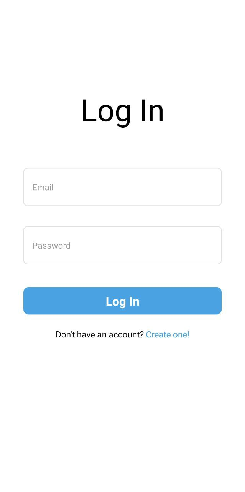
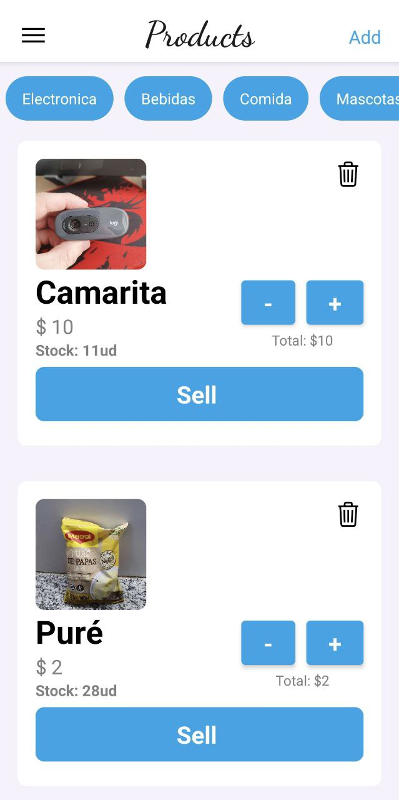
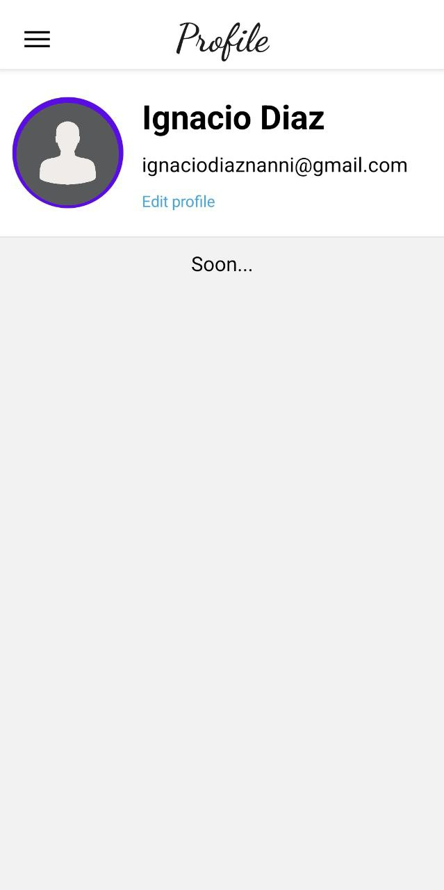
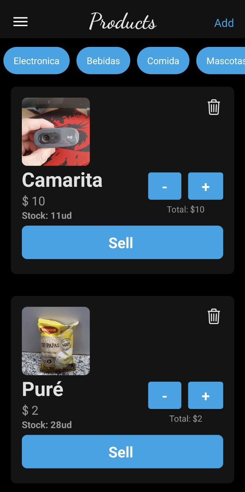
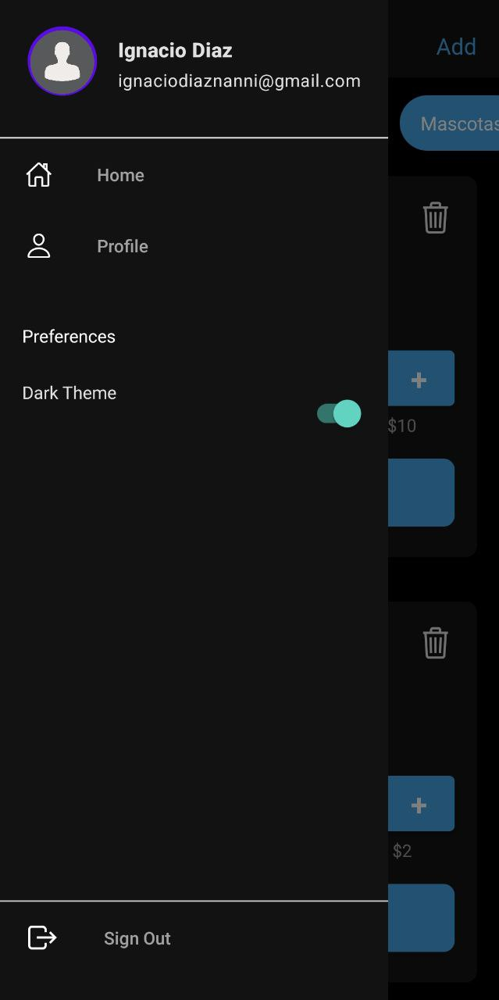
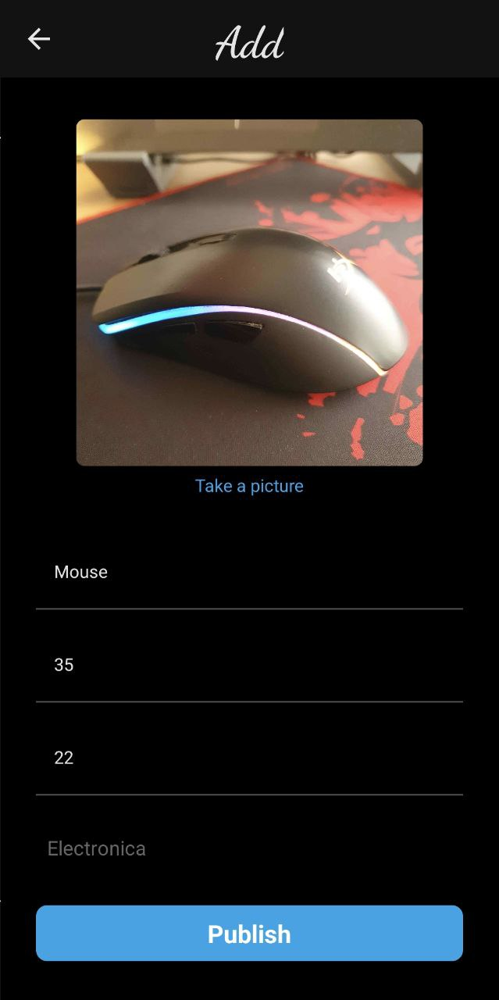
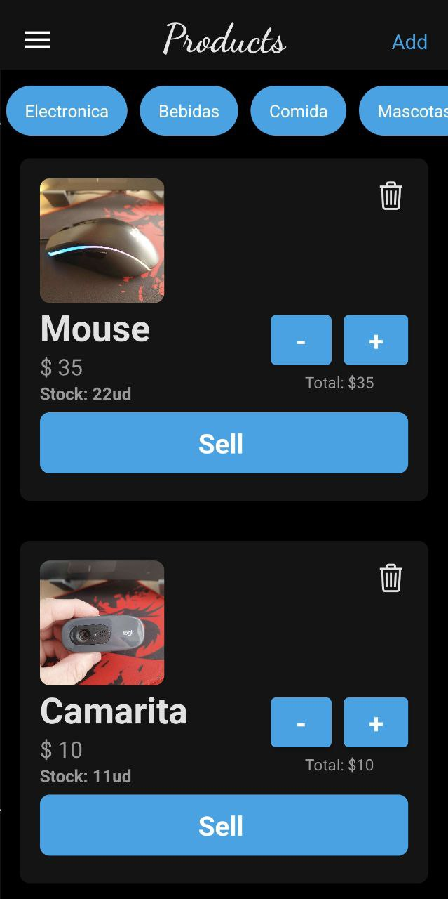

Actualmente la App se encuentra en desarrollo.

  
La finalidad de esta aplicación es poder ser de ayuda para comerciantes a la hora de llevar
  a cabo el stock de su negocio, como así también el manejo de sus clientes.

  
Actualmente me encuentro desarrollando el apartado en el cual el usuario puede generar ordenes y asignarles
    el nombre de un cliente y así tener constancia de que se vendio, que cantidad y a quien.
  

  
Luego de eso voy a implementar un componente en el perfil del usuario que le permita hacer un cierre del
  día para tener organizadas sus ventas día por día.

  La aplicación esta desarrollada con Javascript utilizando React Native, para la base de datos utilizo Firestore
  y Firebase para la gestión de usuarios. Proximamente implementaré otras formas de ingresar a la aplicación,
  por ejemplo con Google o Facebook.

